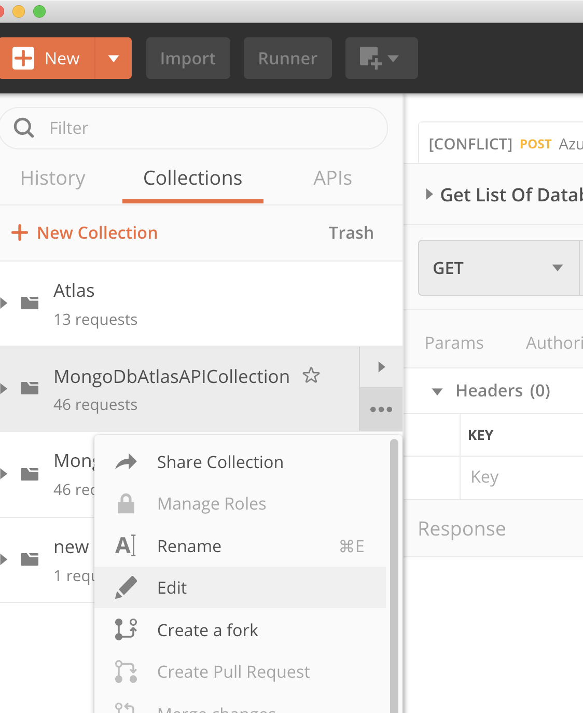
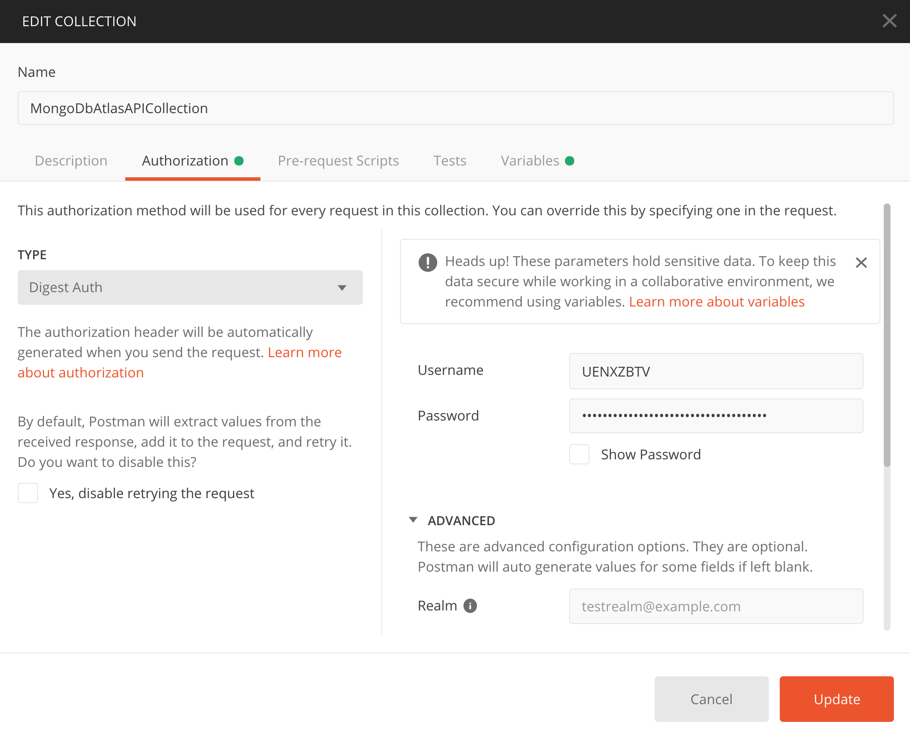
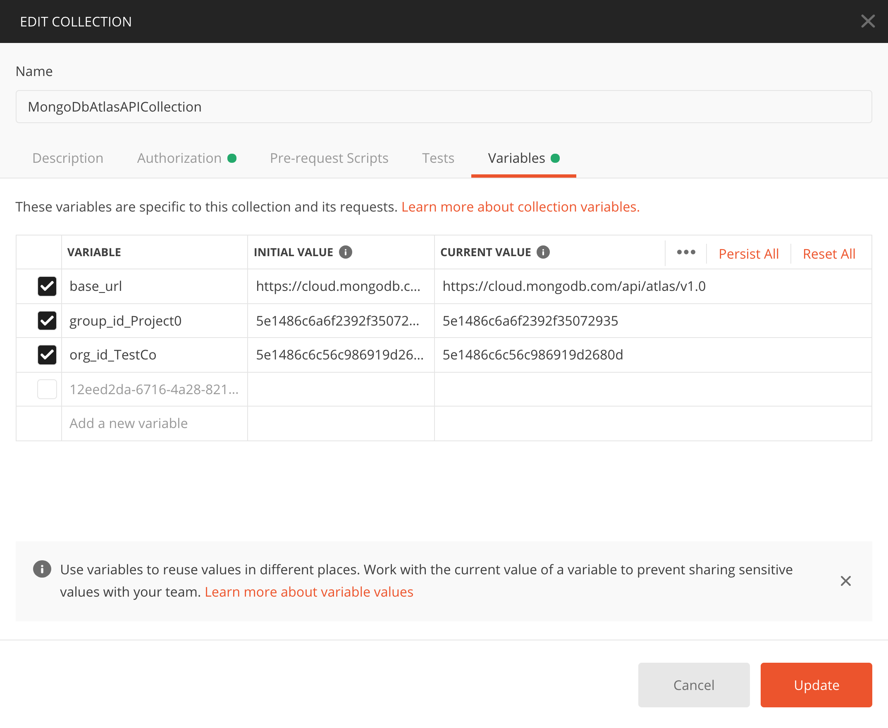

# AtlasApiPostmanCollection

## A Postman collection for MongoDB Atlas APIs

* To use, Import this collection into [Postman using Import button](https://learning.postman.com/docs/postman/collections/data-formats/#importing-postman-data)

* Click on the 3 dots next to collection and choose Edit 

* Provide API Public and Private key, Atlas uses Digest AUTH 

* Edit Variables, ProjectID and OrgID 

* Run requests from Postman, Export to Code and Have fun. You are welcome to add any missing endpoints and other Atlas APi examples. 

